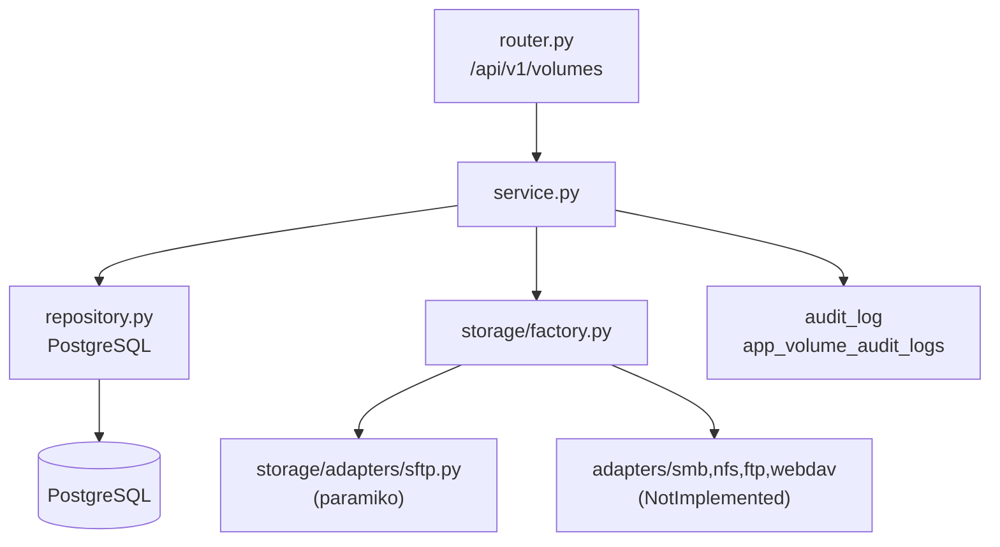

# Plan: Módulo MVP Volumes (Backend + Frontend)

## Contexto del proyecto

- Backend: FastAPI + SQLAlchemy + Alembic, en `apps/api/`
- Frontend: Next.js App Router + Tailwind, en `apps/web/`
- Auth: Azure AD JWT via `UserContext(oid, email, name, groups)`
- Encryption existente: `core.encryption` (Fernet) — misma que usa `data_sources`
- Última migración: `006_job_artifacts.py` (revision=`006`)
- Cliente HTTP: `lib/api/client.ts` con `apiGet/Post/Put/Delete/apiPostFormData`
- Patrón de data fetching: `fetch manual + useState + useEffect` (sin SWR/React Query)
- Notificaciones: se instalará **Sonner** (no existe ninguna librería actualmente)

## Arquitectura general




## BACKEND

### Archivos a crear

```
apps/api/modules/volumes/
├── __init__.py
├── models.py           ← AppVolume + VolumeAuditLog
├── schemas.py          ← Todos los schemas Pydantic
├── repository.py       ← CRUD AppVolume + create_audit_log
├── service.py          ← Negocio + orquestación + auditoría
├── router.py           ← 14 endpoints bajo /api/v1/volumes
└── storage/
    ├── __init__.py
    ├── base.py         ← BaseStorageAdapter (ABC)
    ├── factory.py      ← get_adapter(volume: AppVolume) → BaseStorageAdapter
    └── adapters/
        ├── __init__.py
        └── sftp.py     ← SFTPAdapter (paramiko, completamente funcional)

apps/api/migrations/versions/
├── 007_app_volumes.py
└── 008_volume_audit_logs.py
```

### Archivos a modificar

- `[apps/api/main.py](apps/api/main.py)` — agregar `from modules.volumes.models import AppVolume, VolumeAuditLog` y `app.include_router(volumes_router, prefix="/api/v1")`
- `[apps/api/migrations/env.py](apps/api/migrations/env.py)` — agregar imports de los dos modelos nuevos
- `[apps/api/requirements.txt](apps/api/requirements.txt)` — agregar `paramiko>=3.4.0`

### Modelos

`**AppVolume**` (tabla `app_volumes`):

```python
class AppVolume(Base, UUIDMixin, TimestampMixin):
    __tablename__ = "app_volumes"
    module       = Column(String(64), nullable=False, index=True)
    name         = Column(String(256), nullable=False)
    description  = Column(Text, nullable=True)
    volume_type  = Column(String(32), nullable=False)  # sftp|smb|nfs|ftp|webdav
    host         = Column(String(512), nullable=False)
    share_path   = Column(String(1024), nullable=False)
    port         = Column(Integer, nullable=True)
    username     = Column(String(256), nullable=True)
    encrypted_credentials = Column(JSONB, nullable=True)  # cifrado con Fernet
    is_active    = Column(Boolean, default=True, nullable=False)
```

`**VolumeAuditLog**` (tabla `app_volume_audit_logs`): todos los campos especificados. `user_id` = `UserContext.oid`. IP y user-agent se extraen del `Request` de FastAPI en el router y se pasan al service.

### Schemas clave

- `AppVolumeCreate` / `AppVolumeUpdate` / `AppVolumeResponse` (sin `encrypted_credentials`)
- `AppVolumeConnectionTestResponse(ok, message, latency_ms, error_code?)`
- `FileEntryResponse(name, path, type, size, modified_at, mime_type?, extension?)`
- `DirectoryListResponse(path, entries, total)`
- `FilePreviewResponse(path, content_type, content, size, truncated)`
- `CreateFolderRequest`, `RenameEntryRequest`, `CopyEntryRequest`

### Endpoints (router prefix `/volumes`)


| Método | Path                            | Descripción                  |
| ------ | ------------------------------- | ---------------------------- |
| GET    | `/volumes`                      | Lista todos                  |
| POST   | `/volumes`                      | Crea volumen                 |
| GET    | `/volumes/{id}`                 | Detalle                      |
| PUT    | `/volumes/{id}`                 | Actualiza                    |
| DELETE | `/volumes/{id}`                 | Elimina                      |
| POST   | `/volumes/{id}/test-connection` | Prueba conexión              |
| GET    | `/volumes/{id}/entries?path=/`  | Lista directorio             |
| GET    | `/volumes/{id}/preview?path=`   | Preview archivo              |
| GET    | `/volumes/{id}/download?path=`  | Descarga (StreamingResponse) |
| POST   | `/volumes/{id}/upload`          | Sube archivo                 |
| POST   | `/volumes/{id}/folders`         | Crea carpeta                 |
| PATCH  | `/volumes/{id}/entries/rename`  | Renombra                     |
| POST   | `/volumes/{id}/entries/copy`    | Copia/duplica                |
| DELETE | `/volumes/{id}/entries?path=`   | Elimina entrada              |


### Seguridad paths

El service aplica `sanitize_path(path, share_path)` que:

1. Resuelve con `posixpath.normpath`
2. Valida que el path resultante empiece con `share_path` (evita path traversal)
3. Lanza `HTTPException(400)` si el path es inválido

### Storage Adapter (SFTP)

`SFTPAdapter` (paramiko) implementa todos los métodos de `BaseStorageAdapter`. Maneja:

- Timeouts: `connect_timeout=10s`, `banner_timeout=15s`
- Excepciones mapeadas a `StorageError(code, message)` — nunca expone stack trace
- `copy()`: para carpetas usa recursión (walk + put_r); para archivos, read+write
- `read_file()`: acepta `max_bytes=524288` (512 KB) para preview; lanza `FileTooLargeError` si excede
- Preview tipos soportados: `text/plain`, `application/json`, `text/csv`, `image/*`

### Credenciales cifradas

`encrypted_credentials` es un dict `{"password": "...", "private_key": "..."}` donde cada valor sensible se cifra con Fernet (mismo `core.encryption.encrypt_password` que usa `data_sources`).

---

## FRONTEND

### Archivos a crear

```
apps/web/app/volumes/
└── page.tsx                      ← Página principal (VolumesList + FileBrowser)

apps/web/components/volumes/
├── VolumesList.tsx               ← Tabla de volúmenes
├── VolumeForm.tsx                ← Formulario create/edit
├── VolumeCreateModal.tsx
├── VolumeEditModal.tsx
├── VolumeDeleteAction.tsx        ← Confirma con SweetAlert2... en realidad con Sonner + window.confirm o modal simple
└── file-browser/
    ├── FileBrowserContainer.tsx  ← Orquesta todo el explorador
    ├── FileBreadcrumbs.tsx       ← Ruta actual navegable
    ├── FileEntriesList.tsx       ← Tabla de entradas
    ├── FileEntryRow.tsx          ← Fila individual + menú de acciones
    ├── FilePreviewPanel.tsx      ← Panel lateral de preview
    ├── UploadFileAction.tsx
    ├── CreateFolderAction.tsx
    ├── RenameEntryAction.tsx
    └── CopyEntryAction.tsx

apps/web/lib/api/
└── volumes.ts                    ← Todas las funciones API + tipos

apps/web/app/api/volumes/
├── route.ts                      ← BFF proxy: GET list, POST create
├── [id]/
│   ├── route.ts                  ← BFF: GET, PUT, DELETE
│   ├── test-connection/route.ts
│   ├── download/route.ts         ← BFF streaming para descarga
│   ├── entries/route.ts
│   ├── preview/route.ts
│   ├── upload/route.ts
│   ├── folders/route.ts
│   └── entries/
│       ├── rename/route.ts
│       └── copy/route.ts
```

### Archivos a modificar

- `[apps/web/lib/nav.ts](apps/web/lib/nav.ts)` — nuevo grupo `volumes` con icon `HardDrive`
- `[apps/web/package.json](apps/web/package.json)` — agregar `sonner`

### Patrón de integración con backend

Igual al patrón existente:

```typescript
// page.tsx
const { data: session } = useSession();
const accessToken = (session as {accessToken?: string} | null)?.accessToken ?? null;
// Funciones en lib/api/volumes.ts usan apiGet/apiPost del client.ts existente
```

Download es la excepción: usa un Route Handler BFF (`/api/volumes/[id]/download`) que hace streaming con las credenciales del servidor, igual al patrón de data-quality files.

### Tipos principales en `lib/api/volumes.ts`

```typescript
export interface AppVolume { id, name, module, description, volume_type, host, share_path, port, username, is_active, created_at, updated_at }
export interface FileEntry { name, path, type: "file"|"folder", size, modified_at, mime_type?, extension? }
export type VolumeType = "sftp" | "smb" | "nfs" | "ftp" | "webdav"
```

### Notificaciones (Sonner)

Agregar `<Toaster>` en `app/layout.tsx`. Usar:

- `toast.success("Volumen creado")` para operaciones exitosas
- `toast.error("Error: ...")` para errores
- Para confirmaciones de delete: modal simple inline (no libería extra)

### Navegación

```typescript
// lib/nav.ts — nuevo grupo
{
  id: "volumes",
  label: "Storage & Volumes",
  icon: HardDrive,
  children: [
    { label: "Volumes", href: "/volumes", icon: HardDrive }
  ]
}
```

### Estado del explorador

Estado local en `FileBrowserContainer`:

- `selectedVolumeId`: string | null
- `currentPath`: string (default `"/"`)
- `entries`: FileEntry[]
- Navegación hacia atrás: stack de paths o `posixpath.dirname(currentPath)`

---

## Supuestos y decisiones clave

- **Paramiko (sync)**: El MVP usa SFTP síncrono. Si el proyecto crece, se puede migrar a asyncssh + workers.
- `**encrypted_credentials`** guarda un dict `{password?: string, private_key?: string}` con valores cifrados con Fernet individualmente. El password plano nunca toca el DB.
- **Auditoría desde router**: el router extrae IP (`request.client.host`) y User-Agent (`request.headers.get("user-agent")`) y los pasa al service como `AuditContext` dataclass.
- **Preview limitado a 512 KB**: configurable via env `VOLUME_PREVIEW_MAX_BYTES`.
- **Upload limitado a 100 MB**: configurable via env `VOLUME_UPLOAD_MAX_MB`.
- **Copias síncronas**: sin Celery, operación blocking. Para carpetas grandes puede ser lento — aceptable en MVP.
- **BFF para download**: usa Route Handler de Next.js para no exponer el token al browser en la URL.
- **Protocolos no-SFTP**: `factory.py` lanza `HTTPException(422, "Protocol not implemented")` para smb/nfs/ftp/webdav en este MVP.

